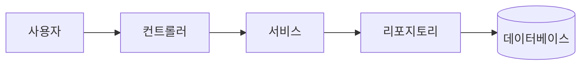
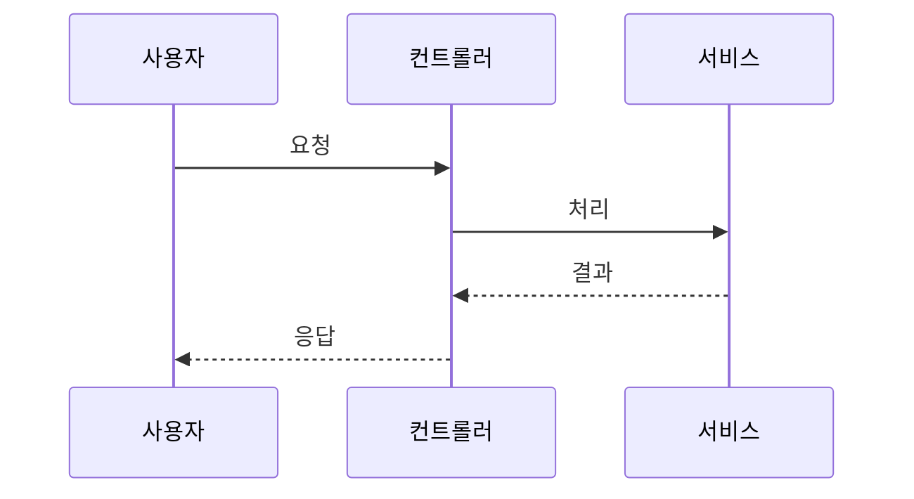

# 문서화 가이드라인

## 다이어그램

모든 다이어그램은 **Mermaid** 문법을 사용합니다.

### 지원 다이어그램 유형
- 플로우차트 (flowchart)
- 시퀀스 다이어그램 (sequenceDiagram)
- 클래스 다이어그램 (classDiagram)
- ER 다이어그램 (erDiagram)
- 상태 다이어그램 (stateDiagram)

### 금지 사항
- ASCII 아트 다이어그램
- 일반 텍스트 박스 다이어그램

### 이유
- GitHub에서 올바르게 렌더링
- IDE 미리보기 지원
- 문서 사이트에서 시각화

## 예시

