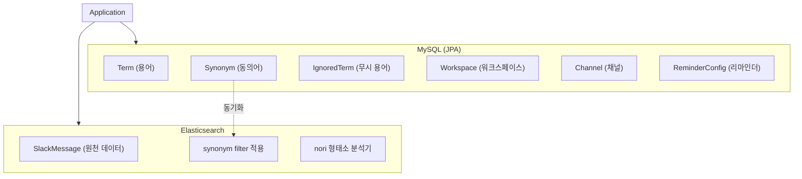
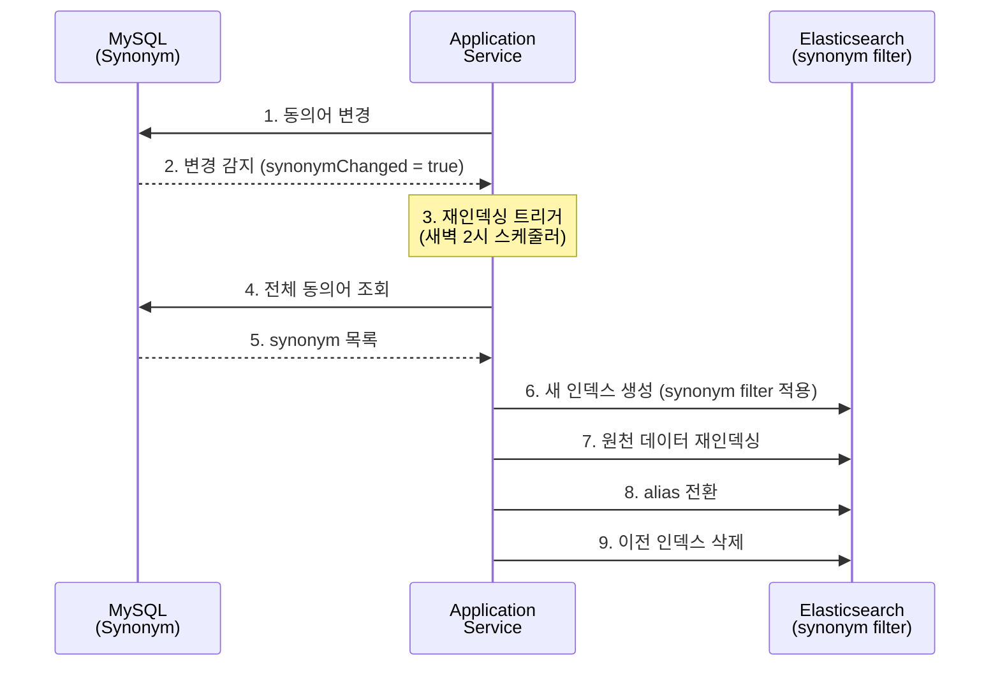
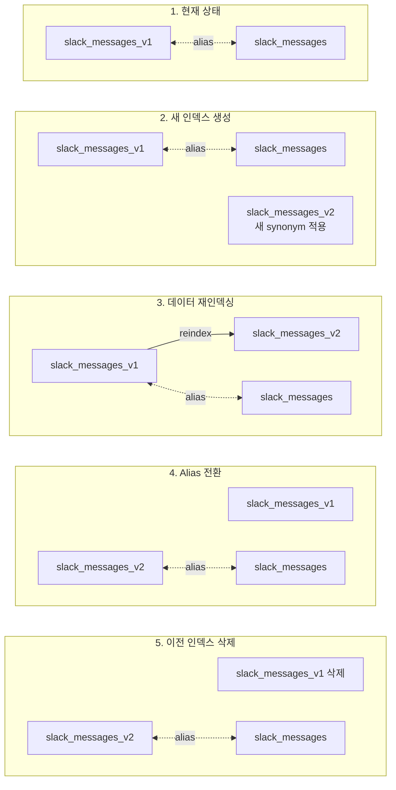
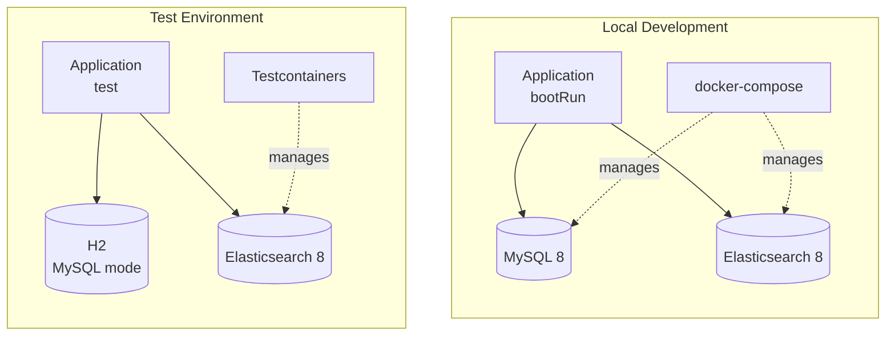
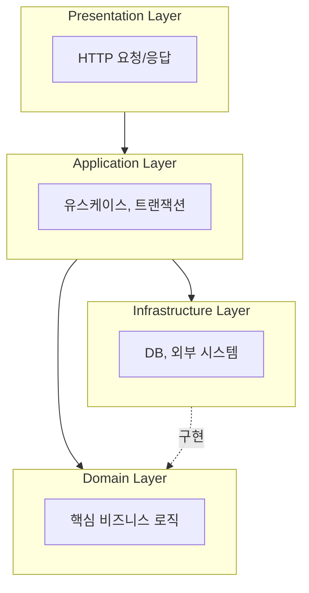

# Architecture

## Glossary

| Name (Korean) | Name (English)    | Definition                             |
|---------------|-------------------|----------------------------------------|
| 용어            | Term              | 사전에 등록되어 정의와 동의어를 가지는 단어               |
| 정의            | Definition        | 용어의 의미를 설명하는 텍스트                       |
| 동의어           | Synonym           | 대표어와 같은 의미를 가지는 다른 표현                  |
| 대표어           | Canonical         | 동의어들의 기준이 되는 용어. 동의어 추출 시 대표어로 치환됨     |
| 무시된 용어        | Ignored Term      | 추출 및 빈도 집계에서 제외되는 용어                   |
| 용어 사전         | Term Dictionary   | 팀 내 용어와 그 정의, 동의어를 관리하는 저장소            |
| 사용자 사전        | User Dictionary   | 형태소 분석기에 등록하여 복합어를 하나의 용어로 인식하게 하는 사전  |
| 빈도            | Frequency         | 특정 기간 동안 용어가 등장한 횟수                    |
| 리마인더          | Reminder          | 등록되지 않은 빈출 용어를 알리는 정기 알림               |
| 재인덱싱          | Reindexing        | 동의어 변경 등으로 인해 원천 데이터를 다시 색인하는 작업       |
| 워크스페이스        | Workspace         | 슬랙의 작업 공간 단위                           |
| 채널            | Channel           | 슬랙 워크스페이스 내의 대화 채널                     |
| 일반명사          | NNG (Common Noun) | 형태소 분석에서 일반적인 명사를 나타내는 품사 태그           |
| 고유명사          | NNP (Proper Noun) | 형태소 분석에서 고유한 이름을 나타내는 품사 태그            |
| 의존명사          | NNB (Bound Noun)  | 형태소 분석에서 다른 말에 의존하여 쓰이는 명사를 나타내는 품사 태그 |

---

## Data Storage Architecture

### Overview



### Storage Responsibilities

| Storage       | Data               | Purpose                         |
|---------------|--------------------|---------------------------------|
| MySQL (JPA)   | Term               | 용어 정의 및 메타데이터 관리 (CRUD)         |
| MySQL (JPA)   | Synonym            | 동의어 관계 관리, ES synonym filter 원본 |
| MySQL (JPA)   | IgnoredTerm        | 무시할 용어 목록 관리                    |
| MySQL (JPA)   | Workspace, Channel | 슬랙 연동 정보 관리                     |
| MySQL (JPA)   | ReminderConfig     | 리마인더 설정 관리                      |
| Elasticsearch | SlackMessage       | 원천 메시지 저장 및 용어 빈도 집계            |

### MySQL Schema (JPA Entities)

```kotlin
@Entity
@Table(name = "terms")
class Term(
    @Id @GeneratedValue(strategy = GenerationType.IDENTITY)
    val id: Long? = null,

    @Column(nullable = false, unique = true)
    val name: String,

    @Column(nullable = false, columnDefinition = "TEXT")
    var definition: String,

    @OneToMany(mappedBy = "term", cascade = [CascadeType.ALL], orphanRemoval = true)
    val synonyms: MutableList<Synonym> = mutableListOf(),

    @Column(nullable = false)
    val createdAt: LocalDateTime = LocalDateTime.now()
)

@Entity
@Table(name = "synonyms")
class Synonym(
    @Id @GeneratedValue(strategy = GenerationType.IDENTITY)
    val id: Long? = null,

    @Column(nullable = false)
    val name: String,  // 동의어

    @ManyToOne(fetch = FetchType.LAZY)
    @JoinColumn(name = "term_id", nullable = false)
    val term: Term     // 대표어 (canonical)
)

@Entity
@Table(name = "ignored_terms")
class IgnoredTerm(
    @Id @GeneratedValue(strategy = GenerationType.IDENTITY)
    val id: Long? = null,

    @Column(nullable = false, unique = true)
    val name: String,

    @Column(nullable = false)
    val createdAt: LocalDateTime = LocalDateTime.now()
)
```

### Elasticsearch Index Design

```json
{
  "settings": {
    "analysis": {
      "filter": {
        "synonym_filter": {
          "type": "synonym",
          "synonyms": []
          // MySQL에서 동기화
        }
      },
      "analyzer": {
        "korean_analyzer": {
          "type": "custom",
          "tokenizer": "nori_tokenizer",
          "filter": [
            "synonym_filter",
            "lowercase"
          ]
        }
      }
    }
  },
  "mappings": {
    "properties": {
      "messageId": {
        "type": "keyword"
      },
      "channelId": {
        "type": "keyword"
      },
      "workspaceId": {
        "type": "keyword"
      },
      "content": {
        "type": "text",
        "analyzer": "korean_analyzer"
      },
      "timestamp": {
        "type": "date"
      },
      "extractedTerms": {
        "type": "nested",
        "properties": {
          "term": {
            "type": "keyword"
          },
          "frequency": {
            "type": "integer"
          }
        }
      }
    }
  }
}
```

### Synonym Synchronization

MySQL의 동의어 데이터를 Elasticsearch의 synonym filter에 적용하는 흐름:



**Synonym Format (MySQL → Elasticsearch)**:

```kotlin
// MySQL에서 조회한 동의어 관계
// Term(name="API") -> Synonym(name="에이피아이"), Synonym(name="인터페이스")

// Elasticsearch synonym filter 형식으로 변환
// "에이피아이, 인터페이스 => API"
fun buildSynonymRules(): List<String> {
    return termRepository.findAllWithSynonyms()
        .filter { it.synonyms.isNotEmpty() }
        .map { term ->
            val synonymNames = term.synonyms.joinToString(", ") { it.name }
            "$synonymNames => ${term.name}"
        }
}
```

### Reindexing Strategy (Zero-Downtime)

재인덱싱 시 무중단 서비스를 위해 **Alias Swap** 전략 사용:



```kotlin
@Service
class ReindexingService(
    private val elasticsearchClient: ElasticsearchClient,
    private val synonymRepository: SynonymRepository,
    private val reindexingStatusRepository: ReindexingStatusRepository
) {
    fun executeReindexing() {
        val currentIndex = getCurrentIndexName()
        val newIndex = generateNewIndexName()

        // 1. 새 인덱스 생성 (MySQL 동의어 적용)
        val synonymRules = buildSynonymRules()
        createIndexWithSynonyms(newIndex, synonymRules)

        // 2. 데이터 재인덱싱
        reindex(currentIndex, newIndex)

        // 3. Alias 전환
        swapAlias(currentIndex, newIndex)

        // 4. 이전 인덱스 삭제
        deleteIndex(currentIndex)
    }
}
```

---

## Environment Configuration

### Overview



### Environment Details

| Environment     | RDB             | Search Engine   | Management     |
|-----------------|-----------------|-----------------|----------------|
| Local (bootRun) | MySQL 8         | Elasticsearch 8 | docker-compose |
| Test            | H2 (MySQL mode) | Elasticsearch 8 | Testcontainers |

### Local Development

로컬 개발 환경에서는 `docker-compose`를 사용하여 MySQL과 Elasticsearch를 실행합니다.

```yaml
# docker-compose.yml
services:
  mysql:
    image: mysql:8
    ports:
      - "3306:3306"
    environment:
      MYSQL_ROOT_PASSWORD: root
      MYSQL_DATABASE: termbase
    volumes:
      - mysql_data:/var/lib/mysql

  elasticsearch:
    image: docker.elastic.co/elasticsearch/elasticsearch:8.12.2
    ports:
      - "9200:9200"
    environment:
      - discovery.type=single-node
      - xpack.security.enabled=false
      - ES_JAVA_OPTS=-Xms512m -Xmx512m
    volumes:
      - es_data:/usr/share/elasticsearch/data

volumes:
  mysql_data:
  es_data:
```

**실행 방법**:

```bash
# 인프라 실행
docker-compose up -d

# 애플리케이션 실행
./gradlew bootRun
```

### Test Environment

테스트 환경에서는 Testcontainers와 H2를 사용하여 외부 의존성 없이 테스트를 실행합니다.

- **MySQL → H2**: H2의 MySQL 호환 모드를 사용하여 MySQL 문법 지원
- **Elasticsearch**: Testcontainers로 실제 Elasticsearch 컨테이너 실행

```kotlin
// TestcontainersConfiguration.kt
@TestConfiguration(proxyBeanMethods = false)
class TestcontainersConfiguration {
    @Bean
    @ServiceConnection
    fun elasticsearchContainer(): ElasticsearchContainer =
        ElasticsearchContainer(
            DockerImageName.parse("docker.elastic.co/elasticsearch/elasticsearch:8.12.2"),
        ).withEnv("xpack.security.enabled", "false")
            .withEnv("ES_JAVA_OPTS", "-Xms256m -Xmx256m")
            .withStartupTimeout(Duration.ofMinutes(3))
}
```

```yaml
# application-test.yml
spring:
  datasource:
    url: jdbc:h2:mem:testdb;MODE=MySQL;DATABASE_TO_LOWER=TRUE
    driver-class-name: org.h2.Driver
  jpa:
    database-platform: org.hibernate.dialect.H2Dialect
```

**실행 방법**:

```bash
# 테스트 실행 (외부 의존성 불필요)
./gradlew test
```

---

## Layered Architecture

본 프로젝트는 **Layered Architecture**를 사용합니다. 각 계층은 명확한 책임을 가지며, 상위 계층은 하위 계층에만 의존합니다.



### 의존성 규칙

- 상위 계층 → 하위 계층으로만 의존 가능
- 하위 계층은 상위 계층을 알지 못함
- Domain Layer는 다른 계층에 의존하지 않음 (Infrastructure와의 의존성 역전 적용)

---

### 1. Presentation Layer

**책임**: HTTP 요청 수신, 입력 검증, 응답 변환

**포함 요소**:

- Controller
- Request/Response DTO
- Exception Handler

**규칙**:

- 비즈니스 로직을 포함하지 않음
- Application Layer의 서비스만 호출
- 입력값 검증 (형식, 필수값)
- HTTP 상태 코드 및 응답 포맷 결정

**예시**:

```kotlin
// Controller: HTTP 요청을 받아 Application Layer에 위임
@RestController
@RequestMapping("/api/terms")
class TermController(
    private val termService: TermService
) {
    @GetMapping("/{id}")
    fun getTerm(@PathVariable id: Long): ResponseEntity<TermResponse> {
        val term = termService.findById(id)
        return ResponseEntity.ok(TermResponse.from(term))
    }

    @PostMapping
    fun createTerm(@Valid @RequestBody request: CreateTermRequest): ResponseEntity<TermResponse> {
        val term = termService.create(request.toCommand())
        return ResponseEntity.status(HttpStatus.CREATED).body(TermResponse.from(term))
    }
}

// Request DTO: 입력값 검증
data class CreateTermRequest(
    @field:NotBlank(message = "용어명은 필수입니다")
    val name: String,

    @field:NotBlank(message = "정의는 필수입니다")
    val definition: String,

    val synonyms: List<String> = emptyList()
) {
    fun toCommand() = CreateTermCommand(
        name = name,
        definition = definition,
        synonyms = synonyms
    )
}

// Response DTO: 응답 변환
data class TermResponse(
    val id: Long,
    val name: String,
    val definition: String,
    val synonyms: List<String>
) {
    companion object {
        fun from(term: Term) = TermResponse(
            id = term.id!!,
            name = term.name,
            definition = term.definition,
            synonyms = term.synonyms.map { it.name }
        )
    }
}
```

---

### 2. Application Layer

**책임**: 유스케이스 조율, 트랜잭션 관리, 도메인 객체 조합

**포함 요소**:

- Application Service
- Command/Query 객체
- Domain Event Publisher

**규칙**:

- 비즈니스 로직은 Domain Layer에 위임
- 트랜잭션 경계 설정
- 여러 도메인 객체 간의 협력 조율
- Infrastructure 접근 시 인터페이스(Port) 사용

**예시**:

```kotlin
// Application Service: 유스케이스 조율
@Service
@Transactional(readOnly = true)
class TermService(
    private val termRepository: TermRepository,
    private val synonymRepository: SynonymRepository
) {
    fun findById(id: Long): Term {
        return termRepository.findById(id)
            .orElseThrow { TermNotFoundException(id) }
    }

    @Transactional
    fun create(command: CreateTermCommand): Term {
        // 중복 검증은 도메인 서비스 또는 여기서 처리
        if (termRepository.existsByName(command.name)) {
            throw DuplicateTermException(command.name)
        }

        val term = Term.create(
            name = command.name,
            definition = command.definition
        )

        val savedTerm = termRepository.save(term)

        // 동의어 등록
        command.synonyms.forEach { synonymName ->
            savedTerm.addSynonym(synonymName)
        }

        return savedTerm
    }

    @Transactional
    fun addSynonym(termId: Long, synonymName: String): Term {
        val term = findById(termId)
        term.addSynonym(synonymName)
        return term
    }
}

// Command 객체: 유스케이스 입력
data class CreateTermCommand(
    val name: String,
    val definition: String,
    val synonyms: List<String>
)
```

---

### 3. Domain Layer

**책임**: 핵심 비즈니스 규칙, 도메인 모델, 불변식 보장

**포함 요소**:

- Entity
- Value Object
- Domain Service
- Repository Interface (Port)

**규칙**:

- 다른 계층에 의존하지 않음 (순수한 Kotlin/Java)
- 비즈니스 불변식(Invariant)을 스스로 보장
- Repository는 인터페이스로 정의 (구현은 Infrastructure에서)
- 풍부한 도메인 모델 (Rich Domain Model) 지향

**예시**:

```kotlin
// Entity: 비즈니스 규칙 캡슐화
@Entity
@Table(name = "terms")
class Term private constructor(
    @Id
    @GeneratedValue(strategy = GenerationType.IDENTITY)
    val id: Long? = null,

    @Column(nullable = false, unique = true)
    val name: String,

    @Column(nullable = false, columnDefinition = "TEXT")
    var definition: String,

    @OneToMany(mappedBy = "term", cascade = [CascadeType.ALL], orphanRemoval = true)
    private val _synonyms: MutableList<Synonym> = mutableListOf()
) {
    val synonyms: List<Synonym>
        get() = _synonyms.toList()

    // 비즈니스 규칙: 동의어 추가
    fun addSynonym(name: String) {
        require(name.isNotBlank()) { "동의어는 빈 문자열일 수 없습니다" }
        require(_synonyms.none { it.name == name }) { "이미 등록된 동의어입니다: $name" }

        _synonyms.add(Synonym(name = name, term = this))
    }

    // 비즈니스 규칙: 동의어 제거
    fun removeSynonym(name: String) {
        val synonym = _synonyms.find { it.name == name }
            ?: throw SynonymNotFoundException(name)
        _synonyms.remove(synonym)
    }

    // 비즈니스 규칙: 정의 수정
    fun updateDefinition(newDefinition: String) {
        require(newDefinition.isNotBlank()) { "정의는 빈 문자열일 수 없습니다" }
        this.definition = newDefinition
    }

    companion object {
        fun create(name: String, definition: String): Term {
            require(name.isNotBlank()) { "용어명은 빈 문자열일 수 없습니다" }
            require(definition.isNotBlank()) { "정의는 빈 문자열일 수 없습니다" }

            return Term(
                name = name.trim(),
                definition = definition.trim()
            )
        }
    }
}

// Value Object 예시
@Embeddable
data class Frequency(
    val count: Int,
    val period: Period
) {
    init {
        require(count >= 0) { "빈도는 0 이상이어야 합니다" }
    }

    enum class Period { DAILY, WEEKLY, MONTHLY }
}

// Repository Interface (Port): Infrastructure 추상화
interface TermRepository : JpaRepository<Term, Long> {
    fun findByName(name: String): Term?
    fun existsByName(name: String): Boolean
    fun findAllByOrderByNameAsc(): List<Term>
}
```

---

### 4. Infrastructure Layer

**책임**: 기술적 구현, 외부 시스템 연동, 데이터 영속화

**포함 요소**:

- Repository 구현체 (JPA, Elasticsearch)
- External API Client (Slack API)
- Configuration
- Messaging (Scheduler, Event Handler)

**규칙**:

- Domain Layer의 인터페이스(Port) 구현
- 외부 시스템 연동 세부사항 캡슐화
- 기술 의존성은 이 계층에만 존재

**예시**:

```kotlin
// JPA Repository: Domain Repository 인터페이스 구현
// Spring Data JPA가 자동으로 구현체 생성
interface JpaTermRepository : TermRepository

// Elasticsearch Repository
interface TermFrequencyElasticsearchRepository : ElasticsearchRepository<TermFrequencyDocument, String> {
    fun findByTermNameAndPeriodBetween(
        termName: String,
        startDate: LocalDate,
        endDate: LocalDate
    ): List<TermFrequencyDocument>
}

// External API Client: 슬랙 연동
@Component
class SlackApiClient(
    private val webClient: WebClient
) {
    fun sendReminder(channel: String, message: String): Mono<SlackResponse> {
        return webClient.post()
            .uri("/chat.postMessage")
            .bodyValue(
                mapOf(
                    "channel" to channel,
                    "text" to message
                )
            )
            .retrieve()
            .bodyToMono(SlackResponse::class.java)
    }

    fun getChannels(workspaceToken: String): Mono<List<SlackChannel>> {
        return webClient.get()
            .uri("/conversations.list")
            .header("Authorization", "Bearer $workspaceToken")
            .retrieve()
            .bodyToMono(SlackChannelListResponse::class.java)
            .map { it.channels }
    }
}

// Scheduler: 재인덱싱 스케줄러
@Component
class ReindexingScheduler(
    private val reindexingService: ReindexingService
) {
    @Scheduled(cron = "0 0 2 * * *") // 매일 새벽 2시
    fun scheduleReindexing() {
        if (reindexingService.isReindexingRequired()) {
            reindexingService.executeReindexing()
        }
    }
}

// Configuration: 기술 설정
@Configuration
class ElasticsearchConfig {
    @Bean
    fun elasticsearchClient(): ElasticsearchClient {
        // Elasticsearch 클라이언트 설정
    }
}
```

---

## Package Structure

```
com.mkroo.termbase/
├── presentation/           # Presentation Layer
│   ├── controller/
│   ├── dto/
│   │   ├── request/
│   │   └── response/
│   └── exception/
│
├── application/            # Application Layer
│   ├── service/
│   └── command/
│
├── domain/                 # Domain Layer
│   ├── model/
│   │   ├── term/
│   │   ├── slack/
│   │   └── reminder/
│   └── repository/
│
└── infrastructure/         # Infrastructure Layer
    ├── persistence/
    │   ├── jpa/
    │   └── elasticsearch/
    ├── external/
    │   └── slack/
    ├── scheduler/
    └── config/
```

---

## Layer Communication Summary

| From           | To             | Method                       |
|----------------|----------------|------------------------------|
| Presentation   | Application    | Service 메서드 직접 호출            |
| Application    | Domain         | Entity/Domain Service 메서드 호출 |
| Application    | Infrastructure | Repository 인터페이스를 통한 호출 (DI) |
| Infrastructure | Domain         | Repository 인터페이스 구현          |
