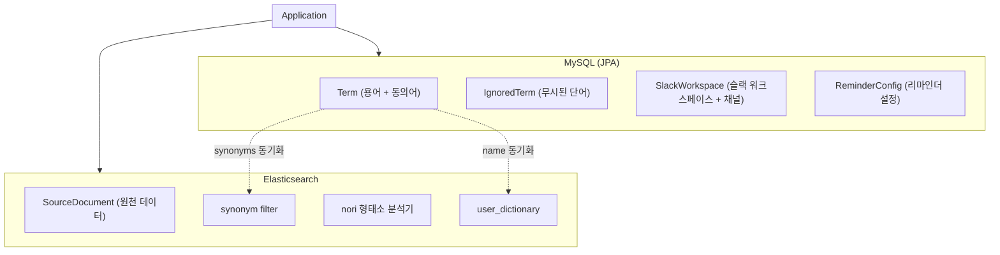
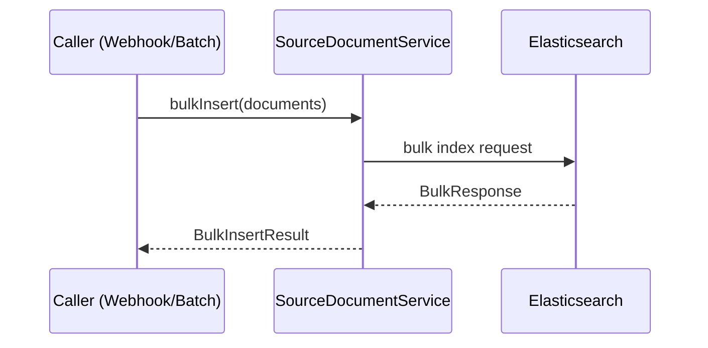
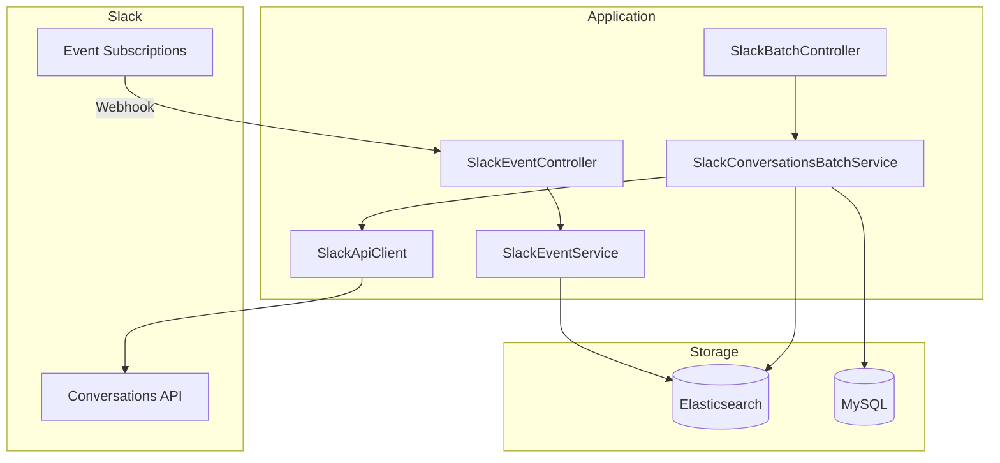
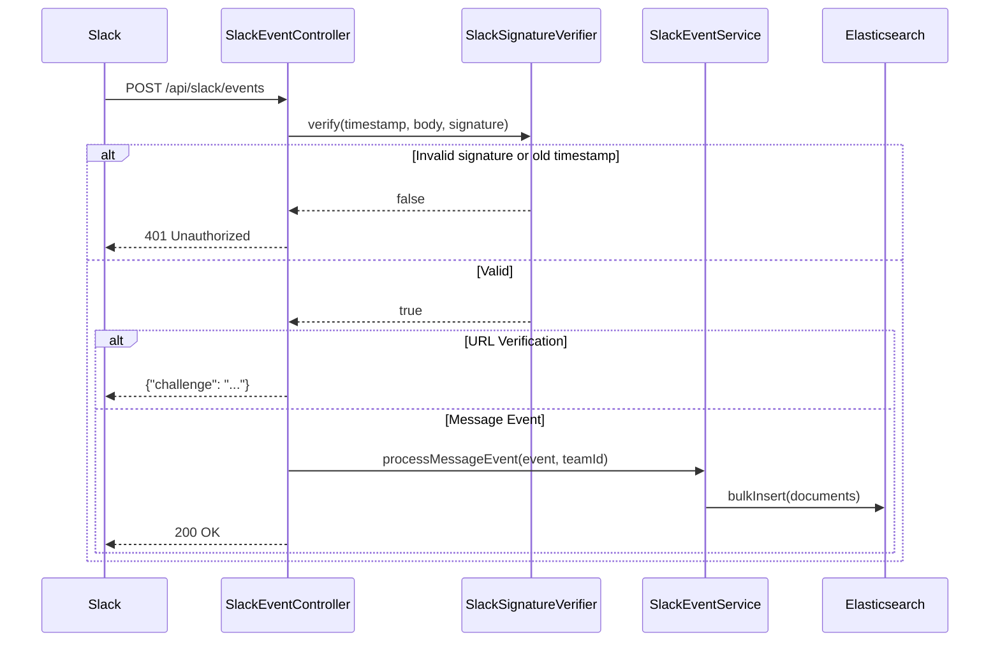
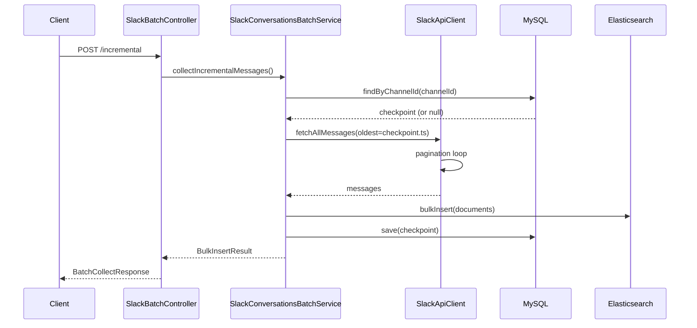
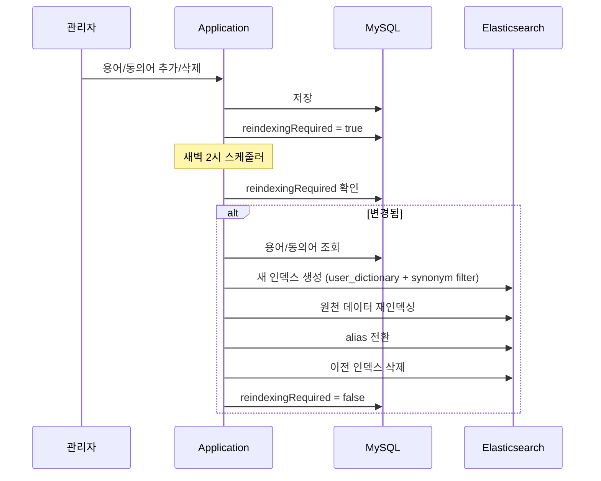
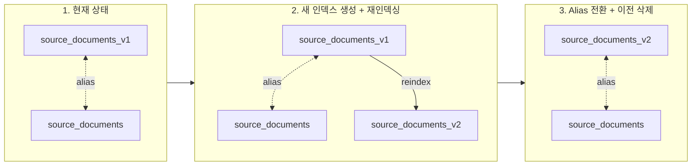
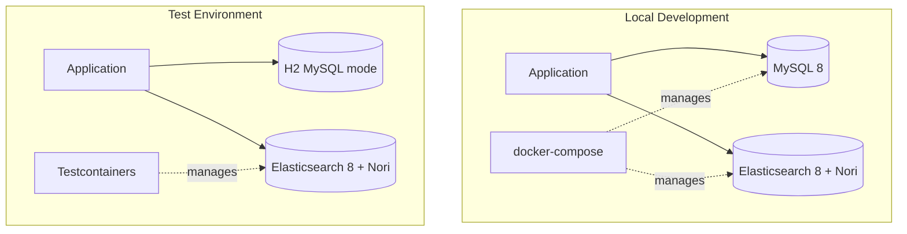
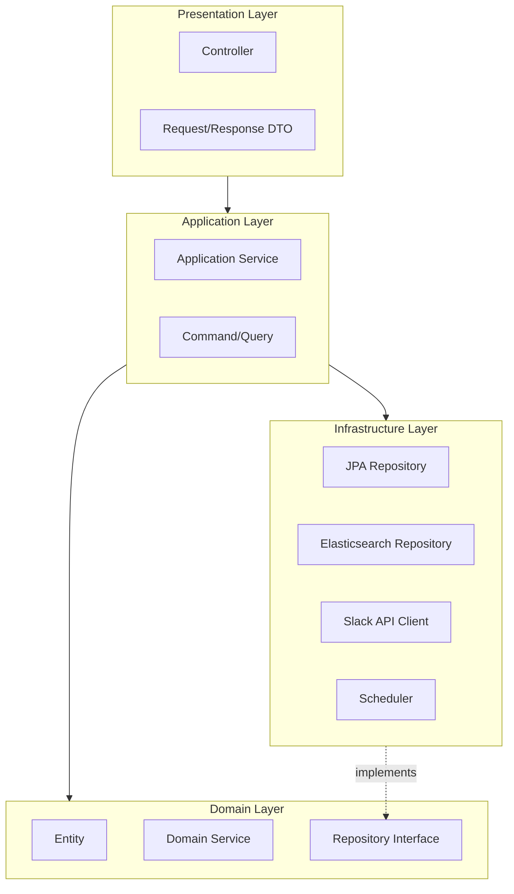

# Architecture

## Data Storage Architecture

### Overview



### Storage Responsibilities

| Storage       | Data           | Purpose                                                |
|---------------|----------------|--------------------------------------------------------|
| MySQL (JPA)   | Term           | 용어 + 동의어 관리, ES user_dictionary/synonym filter 원본 (AR) |
| MySQL (JPA)   | IgnoredTerm    | 무시된 단어 관리 (용어 추출 시 제외 대상)                              |
| MySQL (JPA)   | SlackWorkspace | 슬랙 워크스페이스 + 채널 모니터링 설정 (Aggregate Root)                |
| MySQL (JPA)   | ReminderConfig | 리마인더 설정 (cron 표현식, 상위 N개) 관리                           |
| Elasticsearch | SourceDocument | 원천 데이터 저장 및 용어 빈도 집계 (Slack, Gmail, Webhook 등)         |

---

## MySQL Schema (JPA Entities)

### Term (용어) - Aggregate Root

```kotlin
@Entity
@Table(name = "terms")
class Term(
    @Id @GeneratedValue(strategy = GenerationType.IDENTITY)
    val id: Long? = null,

    @Column(nullable = false, unique = true)
    val name: String,                    // 대표어

    @Column(nullable = false, columnDefinition = "TEXT")
    var definition: String,              // 정의

    @OneToMany(mappedBy = "term", cascade = [CascadeType.ALL], orphanRemoval = true)
    private val _synonyms: MutableList<Synonym> = mutableListOf(),

    @Column(nullable = false, updatable = false)
    val createdAt: LocalDateTime
) {
    val synonyms: List<Synonym> get() = _synonyms.toList()

    fun addSynonym(name: String): Synonym
    fun removeSynonym(name: String)
    fun updateDefinition(newDefinition: String)
}

@Entity
@Table(name = "synonyms")
class Synonym(
    @Id @GeneratedValue(strategy = GenerationType.IDENTITY)
    val id: Long? = null,

    @Column(nullable = false, unique = true)
    val name: String,                    // 동의어

    @ManyToOne(fetch = FetchType.LAZY)
    @JoinColumn(name = "term_id", nullable = false)
    val term: Term                       // 대표어 (canonical)
)
```

### IgnoredTerm (무시된 단어) - Independent Entity

```kotlin
@Entity
@Table(name = "ignored_terms")
class IgnoredTerm(
    @Id @GeneratedValue(strategy = GenerationType.IDENTITY)
    val id: Long? = null,

    @Column(nullable = false, unique = true)
    val name: String,                    // 무시할 단어

    @Column(nullable = false)
    var reason: String,                  // 무시 사유 (필수, 수정 가능)

    @Column(nullable = false, updatable = false)
    val createdAt: LocalDateTime         // 등록 시각
) {
    fun updateReason(newReason: String)
}
```

### SlackWorkspace (슬랙 워크스페이스) - Aggregate Root

```kotlin
@Entity
@Table(name = "slack_workspaces")
class SlackWorkspace(
    @Id @GeneratedValue(strategy = GenerationType.IDENTITY)
    val id: Long? = null,

    @Column(nullable = false, unique = true)
    val teamId: String,                  // 슬랙 팀 ID (T로 시작)

    @Column(nullable = false)
    val name: String,                    // 워크스페이스 이름

    @Column(nullable = false)
    val accessToken: String,             // OAuth 액세스 토큰 (암호화 저장)

    @OneToMany(mappedBy = "workspace", cascade = [CascadeType.ALL], orphanRemoval = true)
    private val _channels: MutableList<SlackChannel> = mutableListOf(),

    @Column(nullable = false, updatable = false)
    val connectedAt: LocalDateTime
) {
    val channels: List<SlackChannel> get() = _channels.toList()

    val monitoredChannels: List<SlackChannel>
        get() = _channels.filter { it.isMonitored }

    fun addChannel(channelId: String, name: String): SlackChannel
    fun removeChannel(channelId: String)
    fun enableMonitoring(channelId: String)
    fun disableMonitoring(channelId: String)
}

@Entity
@Table(name = "slack_channels")
class SlackChannel(
    @Id @GeneratedValue(strategy = GenerationType.IDENTITY)
    val id: Long? = null,

    @Column(nullable = false)
    val channelId: String,               // 슬랙 채널 ID (C로 시작)

    @Column(nullable = false)
    var name: String,                    // 채널 이름

    @ManyToOne(fetch = FetchType.LAZY)
    @JoinColumn(name = "workspace_id", nullable = false)
    val workspace: SlackWorkspace,

    @Column(nullable = false)
    var isMonitored: Boolean = false     // 모니터링 대상 여부
)
```

### ReminderConfig (리마인더 설정)

```kotlin
@Entity
@Table(name = "reminder_configs")
class ReminderConfig(
    @Id @GeneratedValue(strategy = GenerationType.IDENTITY)
    val id: Long? = null,

    @ManyToOne(fetch = FetchType.LAZY)
    @JoinColumn(name = "workspace_id", nullable = false)
    val workspace: SlackWorkspace,

    @Column(nullable = false)
    val targetChannelId: String,         // 리마인더 발송 슬랙 채널 ID

    @Column(nullable = false)
    val cronExpression: String,          // cron 표현식 (예: "0 0 9 * * MON")

    @Column(nullable = false)
    val topN: Int,                       // 상위 N개 용어

    @Column(nullable = false)
    var isEnabled: Boolean = true
)
```

### SourceDocument (원천 문서) - Elasticsearch Document

```kotlin
@Document(indexName = "source_documents")
data class SourceDocument(
    @Id
    val id: String,                      // metadata 기반 고유 ID (중복 방지)

    @Field(type = FieldType.Text, analyzer = "korean_analyzer")
    val content: String,                 // 원천 텍스트 (형태소 분석 대상)

    @Field(type = FieldType.Object)
    val metadata: SourceMetadata,        // 소스별 메타데이터 (sealed interface)

    @Field(type = FieldType.Date)
    val timestamp: Instant               // 원본 생성 시각
)
```

### SourceMetadata (메타데이터) - Sealed Interface

```kotlin
@JsonTypeInfo(
    use = JsonTypeInfo.Id.NAME,
    include = JsonTypeInfo.As.EXISTING_PROPERTY,
    property = "source"
)
@JsonSubTypes(
    JsonSubTypes.Type(value = SlackMetadata::class, name = "slack"),
    JsonSubTypes.Type(value = GmailMetadata::class, name = "gmail"),
    JsonSubTypes.Type(value = WebhookMetadata::class, name = "webhook")
)
sealed interface SourceMetadata {
    val source: String
    fun generateDocumentId(): String     // 중복 방지를 위한 고유 ID 생성
}

data class SlackMetadata(
    override val source: String = "slack",
    val workspaceId: String,             // 슬랙 팀 ID
    val channelId: String,               // 슬랙 채널 ID
    val messageId: String,               // 슬랙 메시지 ID (ts)
    val userId: String                   // 슬랙 사용자 ID
) : SourceMetadata {
    // ID 형식: "slack:{workspaceId}:{channelId}:{messageId}"
    override fun generateDocumentId() = "$source:$workspaceId:$channelId:$messageId"
}

data class GmailMetadata(
    override val source: String = "gmail",
    val messageId: String,               // Gmail 메시지 ID
    val threadId: String,                // Gmail 스레드 ID
    val from: String,                    // 발신자
    val to: List<String>,                // 수신자 목록
    val cc: List<String>,                // 참조 목록
    val subject: String                  // 제목
) : SourceMetadata {
    // ID 형식: "gmail:{messageId}"
    override fun generateDocumentId() = "$source:$messageId"
}

data class WebhookMetadata(
    override val source: String = "webhook",
    val webhookId: String,               // 웹훅 ID
    val eventType: String                // 이벤트 타입
) : SourceMetadata {
    // ID 형식: "webhook:{webhookId}:{eventType}"
    override fun generateDocumentId() = "$source:$webhookId:$eventType"
}
```

---

## Elasticsearch Index Design

### source_documents Index

다양한 소스(Slack, Gmail, Webhook 등)의 원천 데이터를 저장하는 범용 인덱스입니다.

```json
{
  "settings": {
    "analysis": {
      "tokenizer": {
        "nori_user_dict_tokenizer": {
          "type": "nori_tokenizer",
          "user_dictionary_rules": []
        }
      },
      "filter": {
        "synonym_filter": {
          "type": "synonym",
          "synonyms": []
        }
      },
      "analyzer": {
        "korean_analyzer": {
          "type": "custom",
          "tokenizer": "nori_user_dict_tokenizer",
          "filter": [
            "synonym_filter",
            "lowercase"
          ]
        }
      }
    }
  },
  "mappings": {
    "properties": {
      "content": {
        "type": "text",
        "analyzer": "korean_analyzer"
      },
      "metadata": {
        "type": "object",
        "enabled": true
      },
      "timestamp": {
        "type": "date"
      }
    }
  }
}
```

### Metadata Examples by Source

**Slack:**

```json
{
  "content": "오늘 API 연동 작업 완료했습니다.",
  "metadata": {
    "source": "slack",
    "workspaceId": "T123456",
    "channelId": "C789012",
    "messageId": "1234567890.123456",
    "userId": "U456789"
  },
  "timestamp": "2024-01-15T10:30:00Z"
}
```

**Gmail:**

```json
{
  "content": "프로젝트 진행 상황 공유드립니다.",
  "metadata": {
    "source": "gmail",
    "messageId": "msg-abc123",
    "threadId": "thread-xyz789",
    "from": "sender@example.com",
    "to": [
      "receiver@example.com"
    ],
    "cc": [
      "cc@example.com"
    ],
    "subject": "프로젝트 진행 상황"
  },
  "timestamp": "2024-01-15T09:00:00Z"
}
```

**Webhook:**

```json
{
  "content": "배포가 완료되었습니다.",
  "metadata": {
    "source": "webhook",
    "webhookId": "hook-123",
    "eventType": "deployment"
  },
  "timestamp": "2024-01-15T11:00:00Z"
}
```

### Term Frequency Aggregation

용어 빈도 집계는 Elasticsearch의 `terms` aggregation을 사용합니다.
`exclude` 목록은 `ignored_terms` 테이블에서 조회한 무시된 단어입니다.

```json
GET /source_documents/_search
{
  "size": 0,
  "query": {
    "bool": {
      "filter": [
        {
          "term": {
            "metadata.source": "slack"
          }
        },
        {
          "term": {
            "metadata.workspaceId": "T123456"
          }
        },
        {
          "range": {
            "timestamp": {
              "gte": "now-7d/d",
              "lte": "now/d"
            }
          }
        }
      ]
    }
  },
  "aggs": {
    "top_terms": {
      "terms": {
        "field": "content",
        "size": 100,
        "exclude": [
          "무시된용어1",
          "무시된용어2"
        ]
      }
    }
  }
}
```

---

## Bulk Insert Service

### Overview

대량의 SourceDocument를 효율적으로 추가하기 위한 Application Service입니다.
Slack Webhook, 배치 작업 등 다양한 상황에서 사용됩니다.



### Usage Examples

**Slack Webhook Handler:**

```kotlin
@Component
class SlackWebhookHandler(
    private val sourceDocumentService: SourceDocumentService,
) {
    fun handleMessages(messages: List<SlackMessage>) {
        val documents = messages.map { it.toSourceDocument() }
        val result = sourceDocumentService.bulkInsert(documents)
        logger.info("Indexed ${result.successCount}/${result.totalCount} documents")
    }
}
```

**Batch Job:**

```kotlin
@Component
class MessageIndexingBatch(
    private val slackClient: SlackApiClient,
    private val sourceDocumentService: SourceDocumentService,
) {
    fun indexRecentMessages(since: Instant) {
        val messages = slackClient.fetchMessages(since)
        val documents = messages.map { it.toSourceDocument() }
        sourceDocumentService.bulkInsert(documents)
    }
}
```

### Implementation

```kotlin
@Service
class SourceDocumentService(
    private val sourceDocumentRepository: SourceDocumentRepository,
) {
    fun bulkInsert(documents: List<SourceDocument>): BulkInsertResult {
        if (documents.isEmpty()) {
            return BulkInsertResult.empty()
        }
        return sourceDocumentRepository.saveAll(documents)
    }
}

data class BulkInsertResult(
    val totalCount: Int,
    val successCount: Int,
    val failureCount: Int,
    val failures: List<BulkInsertFailure>,
) {
    companion object {
        fun empty() = BulkInsertResult(0, 0, 0, emptyList())
    }
}

data class BulkInsertFailure(
    val index: Int,
    val documentId: String?,
    val reason: String,
)
```

---

## Slack Integration

### Overview

Slack에서 대화를 수집하는 두 가지 방식을 제공합니다:



### Event Subscriptions (실시간 수신)

Slack에서 메시지 이벤트가 발생하면 웹훅으로 실시간 수신합니다.

**엔드포인트:**

| Method | Path | Description |
|--------|------|-------------|
| POST | `/api/slack/events` | Slack Event Subscriptions 웹훅 |

**흐름:**



**서명 검증:**

- HMAC-SHA256 서명 검증 (Signing Secret 사용)
- 5분 이내 요청만 허용 (Replay Attack 방지)

**메시지 필터링:**

- Bot 메시지 제외 (`bot_id` 존재)
- 서브타입 메시지 제외 (`subtype` 존재)
- 사용자가 없는 메시지 제외
- 텍스트가 없는 메시지 제외

### Conversations API Batch (배치 수집)

과거 메시지를 일괄 수집하거나 증분 수집합니다.

**엔드포인트:**

| Method | Path | Description |
|--------|------|-------------|
| POST | `/api/slack/batch/collect` | 수동 수집 (기간 지정) |
| POST | `/api/slack/batch/collect/{channelId}/incremental` | 증분 수집 |

**수동 수집 요청:**

```json
POST /api/slack/batch/collect
{
    "workspaceId": "T123456",
    "channelId": "C789012",
    "oldest": "1704067200.000000",  // optional, Unix timestamp
    "latest": "1704153600.000000"   // optional, Unix timestamp
}
```

**증분 수집 요청:**

```json
POST /api/slack/batch/collect/C789012/incremental
{
    "workspaceId": "T123456"
}
```

**응답:**

```json
{
    "totalCount": 100,
    "successCount": 98,
    "failureCount": 2
}
```

**증분 수집 흐름:**



**체크포인트:**

- `SlackCollectionCheckpoint` 엔티티로 마지막 수집 시점 관리
- 증분 수집 시 `lastCollectedTs` 이후 메시지만 조회
- 수집 완료 후 가장 최신 메시지의 타임스탬프로 업데이트

### Configuration

**application.yml:**

```yaml
slack:
  bot-token: ${SLACK_BOT_TOKEN}      # xoxb-로 시작하는 Bot Token
  signing-secret: ${SLACK_SIGNING_SECRET}  # App Credentials의 Signing Secret
```

**Slack App 권한 (Bot Token Scopes):**

| Scope | Description |
|-------|-------------|
| `channels:history` | 공개 채널 메시지 읽기 |
| `groups:history` | 비공개 채널 메시지 읽기 |

**Event Subscriptions 설정:**

1. Slack App > Event Subscriptions 활성화
2. Request URL: `https://your-domain/api/slack/events`
3. Subscribe to bot events: `message.channels`, `message.groups`

---

## Elasticsearch Synchronization

MySQL의 용어/동의어 데이터를 Elasticsearch의 user_dictionary와 synonym filter에 적용하는 흐름:



**Synonym Format (MySQL → Elasticsearch)**:

```kotlin
// MySQL: Term(name="API") -> Synonym("에이피아이"), Synonym("인터페이스")
// ES format: "에이피아이, 인터페이스 => API"

fun buildSynonymRules(): List<String> {
    return termRepository.findAllWithSynonyms()
        .filter { it.synonyms.isNotEmpty() }
        .map { term ->
            val synonymNames = term.synonyms.joinToString(", ") { it.name }
            "$synonymNames => ${term.name}"
        }
}
```

**User Dictionary (MySQL → Elasticsearch)**:

Term의 name을 nori tokenizer의 user_dictionary_rules로 사용합니다.

```kotlin
// MySQL: Term(name="삼성전자"), Term(name="인공지능")
// ES format: ["삼성전자", "인공지능"]

fun buildUserDictionaryRules(): List<String> {
    return termRepository.findAll()
        .map { it.name }
}
```

**Ignored Terms (용어 추출 시 제외)**:

무시된 단어는 ES 인덱싱이 아닌 용어 빈도 집계 시 제외합니다.

```kotlin
// 용어 빈도 집계 시 무시된 단어 제외
fun getIgnoredTermNames(): List<String> {
    return ignoredTermRepository.findAll()
        .map { it.name }
}
```

---

## Reindexing Strategy (Zero-Downtime)

재인덱싱 시 무중단 서비스를 위해 **Alias Swap** 전략 사용:



---

## Environment Configuration

### Overview



### Environment Details

| Environment | RDB             | Search Engine          | Management     |
|-------------|-----------------|------------------------|----------------|
| Local       | MySQL 8         | Elasticsearch 8 + Nori | docker-compose |
| Test        | H2 (MySQL mode) | Elasticsearch 8 + Nori | Testcontainers |

---

## Layered Architecture



### Layer Responsibilities

| Layer          | Responsibility       | Components                         |
|----------------|----------------------|------------------------------------|
| Presentation   | HTTP 요청/응답 처리, 입력 검증 | Controller, Request/Response DTO   |
| Application    | 유스케이스 조율, 트랜잭션 관리    | Application Service, Command/Query |
| Domain         | 핵심 비즈니스 규칙, 도메인 모델   | Entity, Domain Service, Repository |
| Infrastructure | 기술적 구현, 외부 시스템 연동    | JPA Repository, ES Repository, API |

---

## Package Structure

```
com.mkroo.termbase/
├── presentation/
│   ├── controller/
│   │   ├── TermController.kt
│   │   ├── IgnoredTermController.kt
│   │   ├── SlackWorkspaceController.kt
│   │   └── ReminderController.kt
│   ├── dto/
│   │   ├── request/
│   │   └── response/
│   └── advice/
│       └── GlobalExceptionHandler.kt
│
├── application/
│   └── service/
│       ├── TermService.kt
│       ├── IgnoredTermService.kt
│       ├── SlackWorkspaceService.kt
│       ├── ReminderService.kt
│       └── SourceDocumentService.kt
│
├── domain/
│   ├── model/
│   │   ├── term/
│   │   │   ├── Term.kt                // Aggregate Root (동의어 포함)
│   │   │   └── Synonym.kt
│   │   ├── ignoredterm/
│   │   │   └── IgnoredTerm.kt         // Independent Entity
│   │   ├── slack/
│   │   │   ├── SlackWorkspace.kt      // Aggregate Root (채널 포함)
│   │   │   └── SlackChannel.kt
│   │   ├── document/
│   │   │   ├── SourceDocument.kt      // ES 문서 (@Document)
│   │   │   ├── SourceMetadata.kt      // sealed interface + @JsonTypeInfo
│   │   │   ├── SlackMetadata.kt
│   │   │   ├── GmailMetadata.kt
│   │   │   └── WebhookMetadata.kt
│   │   └── reminder/
│   │       └── ReminderConfig.kt
│   ├── repository/
│   │   ├── TermRepository.kt
│   │   ├── IgnoredTermRepository.kt   // IgnoredTerm 전용 Repository
│   │   ├── SlackWorkspaceRepository.kt
│   │   ├── SourceDocumentRepository.kt
│   │   └── ReminderConfigRepository.kt
│   ├── service/
│   │   └── TermExtractor.kt
│   └── exception/
│       └── TermException.kt
│
└── infrastructure/
    ├── persistence/
    │   ├── jpa/
    │   │   ├── JpaTermRepository.kt
    │   │   ├── JpaIgnoredTermRepository.kt
    │   │   ├── JpaSlackWorkspaceRepository.kt
    │   │   └── JpaReminderConfigRepository.kt
    │   └── elasticsearch/
    │       └── EsSourceDocumentRepository.kt
    ├── external/
    │   └── slack/
    │       └── SlackApiClient.kt
    ├── scheduler/
    │   └── ReminderScheduler.kt
    └── config/
        ├── JpaConfig.kt
        ├── ElasticsearchConfig.kt
        └── SlackConfig.kt
```

---

## Key Design Decisions

### 1. IgnoredTerm은 Term과 독립된 엔티티

`IgnoredTerm`은 `Term`과 완전히 독립된 엔티티입니다. 용어 사전에 등록되지 않은 단어도 무시 처리할 수 있습니다.

**설계:**

- IgnoredTerm은 독자적인 PK를 가짐
- Term, Synonym, IgnoredTerm 간의 name 중복 불허
- `IgnoredTermRepository`를 통해 직접 관리

**장점:**

- 용어 사전에 등록되지 않은 일반 단어도 무시 처리 가능
- 무시된 단어의 수정/삭제가 용어 사전에 영향 없음
- 용어 추출 시 무시 목록 조회가 단순해짐

**제약조건:**

- 무시할 단어는 용어 사전(Term)에 정의되지 않은 용어여야 함
- 무시할 단어는 동의어(Synonym)로 등록되지 않은 용어여야 함
- 무시 사유는 필수

### 2. Term은 Aggregate Root (동의어만 포함)

`Term`이 Aggregate Root이며, `Synonym`만 이에 종속됩니다.

**설계 원칙:**

- 동의어는 Term을 통해서만 접근/수정 가능
- `TermRepository`만 제공 (별도의 SynonymRepository 없음)
- 동의어 추가/삭제는 Term의 메서드를 통해 변경

**동의어 제약조건:**

- 동의어는 용어 사전에 정의되지 않은 용어여야 함
- 동의어는 다른 대표어의 동의어로 이미 등록되지 않아야 함
- 동의어는 대표어와 동일할 수 없음
- 동의어는 무시된 단어로 등록되지 않은 용어여야 함

### 3. SlackWorkspace는 Aggregate Root

`SlackWorkspace`가 Aggregate Root이며, `SlackChannel`은 이에 종속됩니다.

**설계 원칙:**

- 채널은 워크스페이스를 통해서만 접근/수정 가능
- `SlackWorkspaceRepository`만 제공 (별도의 ChannelRepository 없음)
- 채널 모니터링 설정은 워크스페이스의 메서드를 통해 변경

### 4. 재인덱싱 트리거 조건

재인덱싱은 아래 조건에서만 수행됩니다:

- 동의어 추가/삭제 시 (synonym filter 변경)
- 용어 추가/삭제 시 (user_dictionary 변경)
- `reindexingRequired` 플래그로 관리
- 매일 새벽 2시 스케줄러에서 플래그 확인

### 5. Repository 인터페이스 스타일

Spring Data의 최소 `Repository<T, ID>` 인터페이스를 사용합니다.

```kotlin
interface JpaTermRepository : Repository<Term, Long>, TermRepository {
    override fun save(term: Term): Term
    override fun findByName(name: String): Term?
    // ...
}

interface JpaIgnoredTermRepository : Repository<IgnoredTerm, Long>, IgnoredTermRepository {
    override fun save(ignoredTerm: IgnoredTerm): IgnoredTerm
    override fun findByName(name: String): IgnoredTerm?
    override fun deleteByName(name: String)
    override fun existsByName(name: String): Boolean
    // ...
}
```
