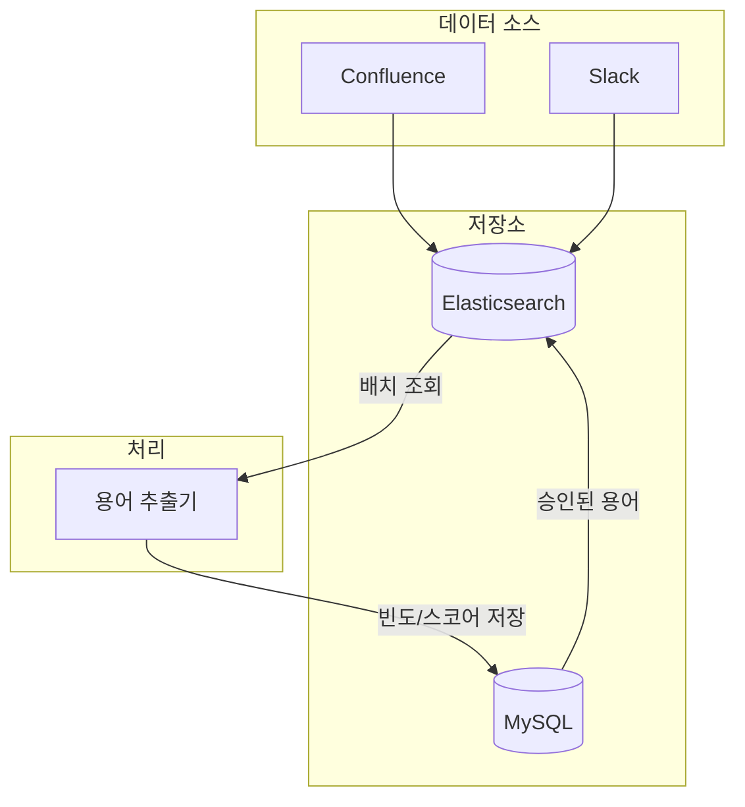
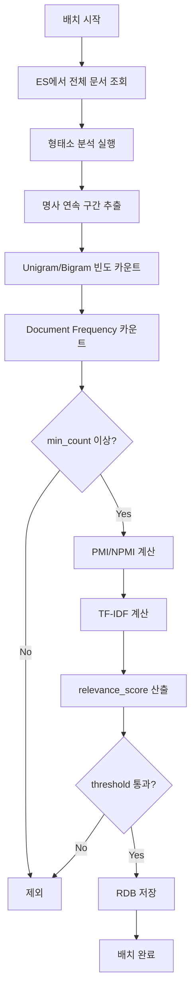
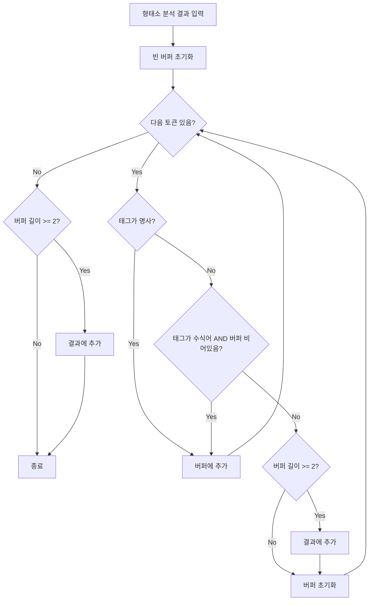
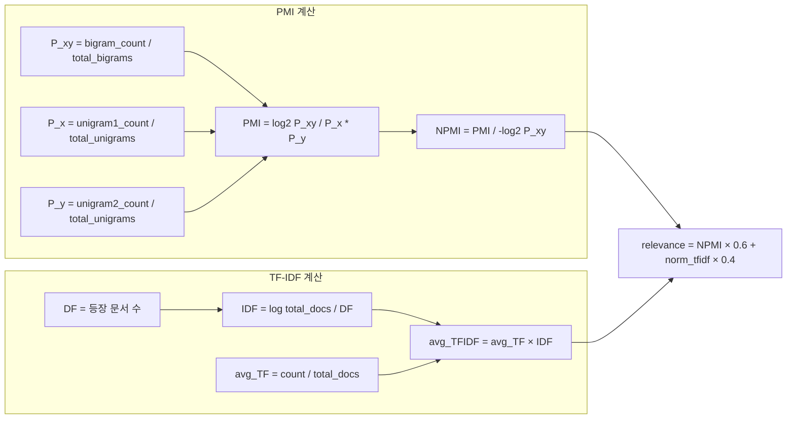
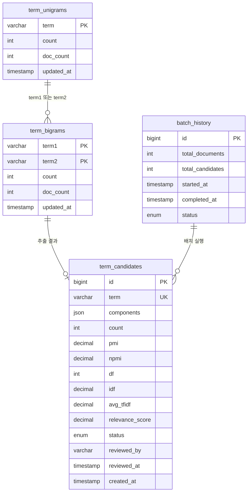
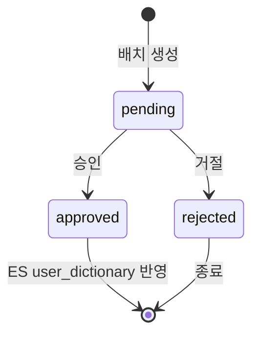

# 용어사전 후보 추출 시스템 설계

## 개요

Confluence, Slack 등의 문서에서 의미 있는 복합 명사구를 자동 추출하여 용어사전 후보를 도출하는 시스템입니다.

## 아키텍처



## 핵심 개념

### 품사 기반 N-gram vs ES Shingle

|       | ES Shingle            | 품사 기반 N-gram                |
|-------|-----------------------|-----------------------------|
| 처리 방식 | 토큰 순서만 보고 모든 인접 조합 생성 | 조사/어미로 끊어진 구간 분리, 명사 연속만 추출 |
| 결과 품질 | 노이즈 포함                | 의미 있는 조합만                   |

예시: "공유 주차장에서 결제를 진행했습니다"

- ES Shingle: (공유, 주차장), (주차장, 결제), (결제, 진행)
- 품사 기반: (공유, 주차장)만 추출

### PMI (Pointwise Mutual Information)

두 단어가 우연히 함께 나타난 것인지, 의미적으로 연결된 것인지 측정합니다.

```
PMI(x, y) = log₂( P(x,y) / (P(x) × P(y)) )
```

- P(x,y): 두 단어가 함께 등장할 확률
- P(x) × P(y): 독립적이라고 가정할 때 예상 확률
- PMI > 0: 예상보다 자주 함께 등장 → 의미 있는 조합
- NPMI: -1 ~ 1 범위로 정규화 (저빈도 과대평가 방지)

### TF-IDF 활용

| PMI | TF-IDF | 해석                 | 우선순위  |
|-----|--------|--------------------|-------|
| 높음  | 높음     | 의미 있는 복합어 + 중요 용어  | 1순위   |
| 높음  | 낮음     | 항상 붙어다니지만 일반적 표현   | 낮음    |
| 낮음  | 높음     | 복합어 아니지만 중요한 단일 용어 | 별도 검토 |

## 배치 처리 플로우



## 명사 시퀀스 추출 로직



## 스코어 계산 공식



## 데이터베이스 스키마



## 검토 워크플로우



## 파라미터 가이드

| 파라미터             | 설명              | 조정 기준                   |
|------------------|-----------------|-------------------------|
| min_count        | 최소 등장 빈도        | 문서 1천개: 3-5, 1만개: 10-20 |
| pmi_threshold    | PMI 최소값         | 노이즈 많으면 2.5-3.0으로 상향    |
| npmi_threshold   | NPMI 최소값        | 0.2-0.4 범위, 저빈도 과대평가 방지 |
| relevance_weight | NPMI:TF-IDF 가중치 | 기본 0.6:0.4, 도메인에 따라 조정  |

## 형태소 분석기 선택

### 비교 대상

| 분석기 | 라이브러리 | 특징 |
|--------|-----------|------|
| Komoran | `com.github.shin285:KOMORAN:3.3.9` | 순수 Java, 사용자 사전 지원 |
| OKT | `org.openkoreantext:open-korean-text:2.1.0` | Twitter에서 개발, Scala 기반 |
| Nori | `org.apache.lucene:lucene-analysis-nori:10.1.0` | Elasticsearch 내장 분석기와 동일 |

### 벤치마크 결과 (100개 문서 기준)

| 분석기 | 초기화 시간 | 분석 시간 | 문서당 평균 |
|--------|-----------|----------|-----------|
| Komoran | 1,005ms | 4,571ms | 45ms |
| OKT | 1ms | 1,656ms | 16ms |
| **Nori** | **4ms** | **87ms** | **<1ms** |

### 품질 비교

**입력**: "주차프로덕트그룹 비전 - 이동의 끝에서 시작하는 완벽한 주차 경험"

| 분석기 | 추출 결과 | 문제점 |
|--------|----------|--------|
| Komoran | 주차, 프로덕트, 그룹, 비전, 이동, 끝, 시작, 주차, 경험 | 정상 |
| OKT | 주차, **프로 덕트**, 그룹, 비전... | "프로덕트"를 "프로 덕트"로 분리 |
| Nori | 주차, 프로덕트, 그룹, 비전, 이동, 끝, 시작, 주차, 경험 | 정상 |

### 결정: Nori 선택

**이유:**
1. **속도**: Komoran 대비 47배 빠름 (994개 문서 처리 시 ~1초)
2. **일관성**: Elasticsearch 내장 분석기와 동일한 엔진 사용
3. **품질**: OKT의 복합어 분리 오류 없음
4. **유지보수**: Apache Lucene 프로젝트로 지속적인 업데이트

### 고려사항

- Nori는 사용자 사전 추가 시 재컴파일 필요 (ES 재시작과 동일)
- Komoran은 런타임 사전 추가 가능하나 속도 대비 이점 부족
- 잘못 분리된 복합어는 NPMI 기반으로 탐지하여 사전 추가 권장